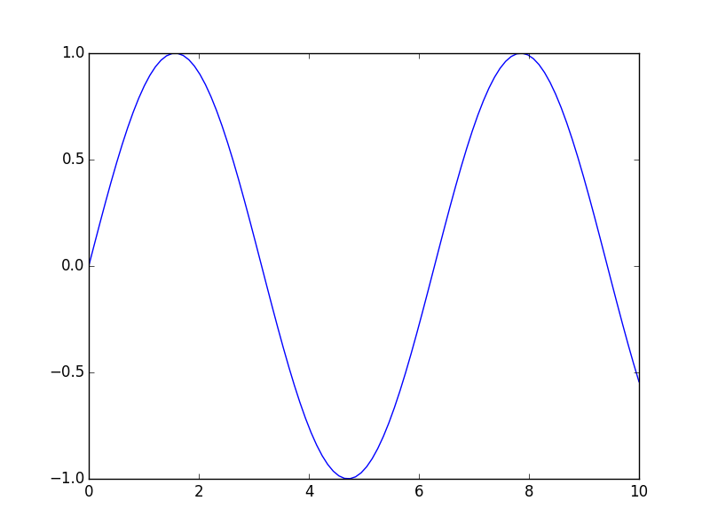
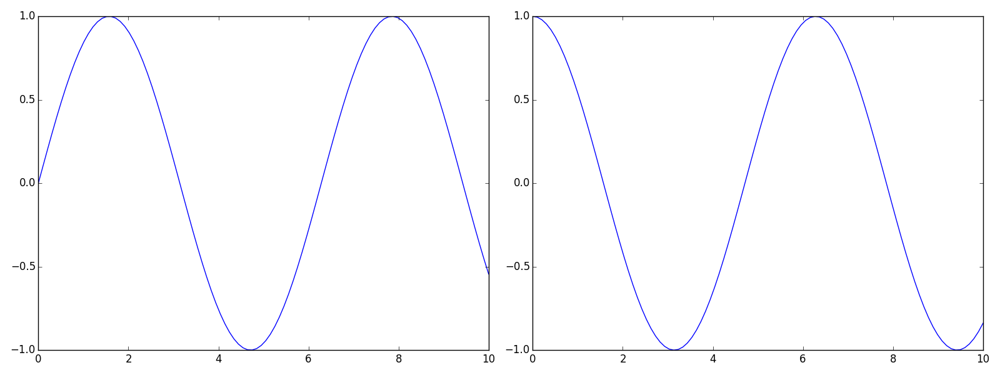

Matplotlib
==========

`Matplotlib <http://matplotlib.org/>`_ is dedicated to making scientific plots. It can also be used for some user interfaces, and is much more friendly than QT.

Introduction
------------

Plotting images can be done in two ways. Matlab style is familiar to Matlab users, but relies on the software figuring out what you mean. For instance, you can create a plot like so:

.. literalinclude:: matlabstyle.py
   :language: python
   :lines: 2-

This certainly works, but what if you want to manipulate the figure, the axes, etc.? You have to access the figure and axes objects, and Matplotlib will only access the figure and axis with focus. It's much more Pythonic, and powerful, to access the figures and axes themselves, and things especially become easier to align if you use `GridSpec <http://matplotlib.org/users/gridspec.html>`_:

.. literalinclude:: pythonstyle.py
   :lines: 2-

While this is great, Pythonic, and very clear as to what is happening, it is also cumbersome! In the course of making plots, this happens a lot. That's exactly why this module exists. It is much simpler to do:

.. literalinclude:: mystyle.py
   :lines: 2-

.. image:: mystyle.png
   :height: 200px
   :align: left
