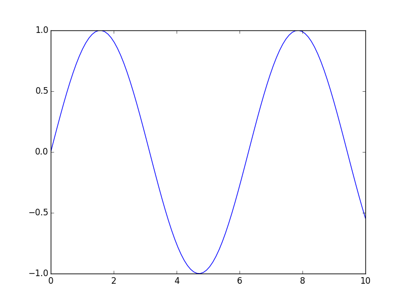
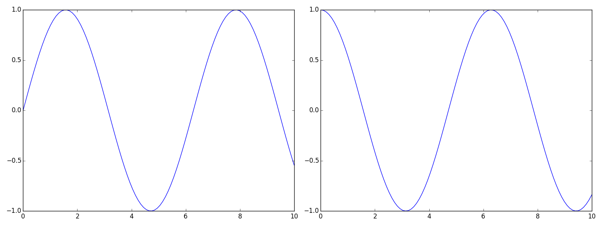

Matplotlib
==========

`Matplotlib <http://matplotlib.org/>`_ is dedicated to making scientific plots. It can also be used for some user interfaces, and is much more friendly than QT.

Introduction
------------

Plotting images can be done in two ways. Matlab style is familiar to Matlab users, but relies on the software figuring out what you mean. For instance, you can create a plot like so:

.. literalinclude:: matlabstyle.py
   :language: python
   :lines: 2-

This certainly works, but what if you want to manipulate the figure, the axes, etc.? You have to access the figure and axes objects, and Matplotlib will only access the figure and axis with focus. It's much more Pythonic, and powerful, to access the figures and axes themselves, and things especially become easier to align if you use `GridSpec <http://matplotlib.org/users/gridspec.html>`_:

.. literalinclude:: pythonstyle.py
   :lines: 2-

.. image:: pythonstyle.png
   :height: 200px
   :align: left

While this is great, Pythonic, and very clear as to what is happening, it is also cumbersome! In the course of making plots, this happens a lot. That's exactly why this module exists. It is much simpler to do:

.. literalinclude:: mystyle.py
   :lines: 2-

Recommended Setup
-----------------

In order to make it easier, several convenience functions have been added. Each type of matplotlib plot has its own quirks, so there are convenience functions for each. It is highly recommended to create a `matplotlibrc file <http://matplotlib.org/users/customizing.html>`_ with a few defaults::

        backend : Qt4Agg
        text.latex.preamble : \usepackage{booktabs},\usepackage{color},\usepackage{siunitx}
        
        figure.figsize : 8, 6
        figure.autolayout : True
        image.cmap : viridis
        image.interpolation : nearest
        
        image.origin : 'lower'
        
This file accomplishes the following:

* Make sure the backend is Qt4Agg
* Use latex in figures, with the `booktabs`, `color`, and `siunitx` packages enabled
* Set the default figure to be 8" wide and 6" high
* Figures automatically resize their contents to use the most of the space available
* If using SciSalt, use the viridis color map by default
* Make the image origin to the lower left

Creating Axes
-------------

Basic
^^^^^

Every plot relies on first creating a figure and its axes. In order to make this process less cumbersome, two helper functions can be used. The most common usage will be to create a :class:`figure <matplotlib.figure.Figure>` with :class:`axes <matplotlib.axes.Axes>` laid out in a grid::

        >>> fig, ax = scisalt.matplotlib.setup_axes(rows=2, cols=3)
        >>> ax.shape
        (2, 3)

Advanced
^^^^^^^^

It is most powerful to create a :class:`figure <matplotlib.figure.Figure>` and a :class:`gridspec <matplotlib.gridspec.GridSpec>` using :func:`scisalt.matplotlib.setup_figure`::

        >>> fig, gs = scisalt.matplotlib.setup_figure(rows=2, cols=3)

This creates a figure and a gridspec instance in one step, which you can then use to make custom divisions of the figure::

        >>> ax1 = fig.add_subplot(gs[0:2, 0])
        >>> ax2 = fig.add_subplot(gs[0, 1:3])
        >>> ax3 = fig.add_subplot(gs[1:3, 1:3])

Plotting
--------

Plotting can also be cumbersome. Typically, plots need to be added. Matplotlib also has quirks. For example, images don't work the way physicists might expect, with our convention of the origin at the bottom left corner, positive axes proceeding up and to the right. Then labels need to be added, and the figure tightened up. All told, setting up a figure can take a lot of time.

Images
^^^^^^

Images generally start as arrays. For this example, create a 2-D array to use::

        >>> x = np.linspace(0, 10, 100)
        >>> y = np.linspace(0, 10, 100)
        >>> mesh = np.meshgrid(x, y)
        >>> img = np.sin(mesh[0] * np.cos(mesh[1])

Plotting an image with matplotlib puts the axes in the upper right corner, with positive y-values down instead of up. This is undesirable from a physics perspective, and fixing this problem every time is cumbersome. :func:`scisalt.matplotlib.imshow` solves this problem (and scales the window and image to look good)::

        >>> fig, ax, im = scisalt.matplotlib.imshow(img)

Or alternatively::

        >>> fig, ax = scisalt.matplotlib.setup_axes()
        >>> im = scisalt.matplotlib.imshow(img, ax=ax)

.. note::
   
   If you would like to create an array of images that share the same axes, look at `ImageGrid <http://matplotlib.org/mpl_toolkits/axes_grid/users/overview.html#imagegrid>`_.
